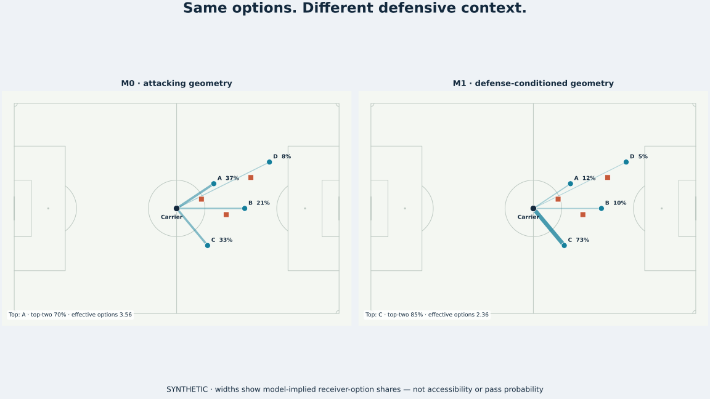

# Disrupting the Network

**How does defensive positioning reshape attacking options before a tackle or
interception ever happens?**

Most defensive statistics begin when a defender touches the ball. This project
starts earlier. It uses football tracking data to study how the location of
defenders changes the choices available to a player in possession: which
teammates appear easy to connect with, which routes are crowded, and whether
those local relationships can eventually support a dynamic view of the attacking
option network.

The project is an entry in the **PySport Analytics Cup 2.0, USA Football /
Defensive Positioning challenge**, using permitted SkillCorner Australia
A-League 2024/25 data.



The figure is fully synthetic. Edge width shows model-implied receiver-option
share, not true accessibility or pass probability. See the
[eight-second animation](outputs/public_examples/synthetic_option_network_animation.gif).

## What has been established

The empirical foundation is a receiver-selection ranking benchmark. At the
moment immediately before a provider-recorded pass transition, each eligible
teammate is treated as a candidate receiver. Three transparent models rank those
candidates:

- **M0** uses attacking geometry only: connection length and longitudinal and
  lateral displacement from the ball carrier.
- **M1** adds two defensive relationships: the nearest defender to the receiver
  and the nearest defender to the finite carrier–receiver segment.
- **M2** adds one fixed measure of distributed defender proximity around that
  segment.

Mean reciprocal rank (MRR) rewards a model when the provider-targeted receiver
appears near the top of its candidate list. On a protected ten-match evaluation,
M0 achieved `0.487333389` MRR and M1 achieved `0.579003393`, a gain of
`0.091670004`. M1 improved MRR, Hit@1, and Hit@3 in every match. This is the
project's major replicated result: transparent defensive geometry contains
robust receiver-selection ranking information beyond attacking geometry alone.

M2 reached `0.585853527` MRR, adding `0.006850134` over M1. Its MRR gain was
positive in all ten matches, but the secondary evidence was less uniform: Hit@1
improved in nine matches and Hit@3 split five positive and five negative. M2 is
therefore a smaller, metric-dependent refinement rather than the headline
result. Full evidence and qualifications are in the
[Session 6e decision brief](docs/session_06e_corrected_reserved_evaluation_decision_brief.md)
and [claim ledger](docs/claim_status.md).

## What the result does not establish

The benchmark predicts a useful SkillCorner vendor target with **Tier B label
limitations**. It does not independently observe every receiver the player
considered or every option that was truly available. Accessibility remains
**PROXY ONLY**, and suppression remains **NOT SUPPORTABLE**.

The tracking product is extrapolated, so this is an offline benchmark rather
than a proven real-time system. The results do not identify causal defender
effects, the best pass, pass success, player quality, tactical intent, or
defensive value. They generalize to the evaluated competition matches, not
automatically to unseen teams, leagues, or providers.

The closed development-only [Session 7 diagnostic](docs/session_07_construct_validity_diagnostic_report.md)
found useful, coherent receiver-selection geometry while leaving accessibility
interpretation weak. Its independent-human-review branch was withdrawn before
responses were collected, so no human judgment supports that conclusion.

## Why the network still matters

Receiver ranking is the validation mechanism for a possible edge representation,
not the final conceptual endpoint. The broader theory is that attacking players
form a changing set of possible connections and that defenders can reshape that
set without winning the ball. If the edge semantics survive construct diagnosis,
the next broader question is whether those connections support an interpretable
dynamic attacking-option network and, later, whether disruption can be studied
alongside defensive structural cost.

**THE GRAPH IS NOT THE STARTING POINT.** Network topology, centrality, community
detection, defender attribution, and value models require separate scientific
questions and evidence. A graph is useful only after its edges mean something.
See the [research roadmap](docs/research_roadmap.md),
[Phase 07a](docs/protocols/phase_07a_human_review_withdrawal.md), and
[governance rules](docs/research_governance.md).

## Experimental public API

The repository now includes a reusable, provider-independent experimental
Python API. A public workflow moves from a Kloppy frame or explicit neutral
state, through the frozen geometry and option-network calculation, to a
dataframe, pitch visual, or animation. Models remain explicit inputs; importing
the package never loads competition data or fitted coefficients.

Kloppy supplies the optional provider-neutral frame adapter, mplsoccer supplies
the football canvas, pandas supplies optional tabular export, and Matplotlib with
Pillow produces the public static and animated examples. The numerical core
requires only NumPy. See the [API guide](docs/public_api.md) and runnable
[quickstart](examples/quickstart.py). matplotvideo remains deferred because this
project generates synthetic animation rather than synchronizing plots to video.
The [library review](references/library_review.md) records the adoption decisions.

The repository already contains protocol-bound acquisition, integrity,
population, conditional-choice modeling, geometric feature, protected-evaluation,
and diagnostic code. Scientific outputs are hash-bound and negative or invalid
executions remain part of the record. This combines tracking-data analysis,
geometric feature engineering, protected validation, testing, reproducibility,
and open-source software design.

## Explore the repository

Use Python 3.11+ and the open-source `uv` environment manager:

```sh
uv sync --locked
uv run --locked python -m unittest discover -s tests -v
uv run --locked python examples/quickstart.py --output quickstart.svg
```

Software tests use synthetic fixtures and do not download competition data.
Reproducing empirical results requires separately obtained, competition-permitted
SkillCorner files and the relevant frozen protocol; see
[data guidance](data/README.md), [scripts](scripts/README.md), and
[outputs](outputs/README.md). Start scientific review with the
[research log](docs/research_log.md) and [current claims](docs/claim_status.md).

The competition requires a public open-source repository, reproducible work, a
one-minute YouTube pitch, and a README below 1,000 words with at most two figures
and tables combined. See the [recorded rules](docs/competition_rules.md). Code
and original documentation use the [MIT License](LICENSE.md); SkillCorner data
is not included or relicensed.
